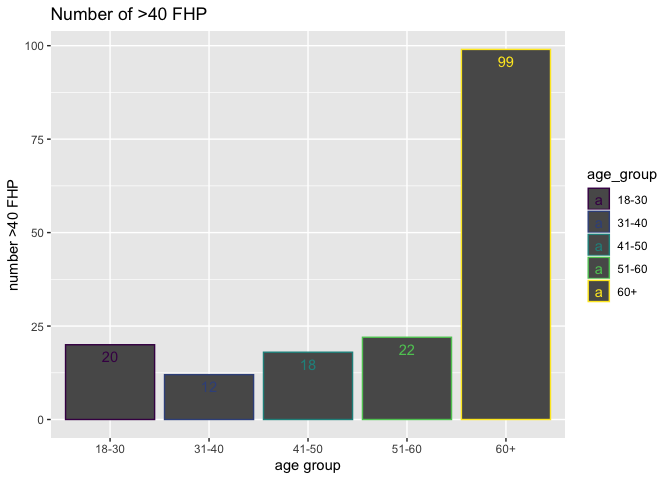

p8105\_midterm\_mk4022
================
Mary Knoop
10/24/2019

Load librarires for
    analysis

``` r
devtools::install_github("thomasp85/patchwork")
```

    ## Skipping install of 'patchwork' from a github remote, the SHA1 (36b49187) has not changed since last install.
    ##   Use `force = TRUE` to force installation

``` r
library(tidyverse)
```

    ## ── Attaching packages ───────────────────────────────────────────────────────────────────── tidyverse 1.2.1 ──

    ## ✔ ggplot2 3.2.1     ✔ purrr   0.3.2
    ## ✔ tibble  2.1.3     ✔ dplyr   0.8.3
    ## ✔ tidyr   1.0.0     ✔ stringr 1.4.0
    ## ✔ readr   1.3.1     ✔ forcats 0.4.0

    ## ── Conflicts ──────────────────────────────────────────────────────────────────────── tidyverse_conflicts() ──
    ## ✖ dplyr::filter() masks stats::filter()
    ## ✖ dplyr::lag()    masks stats::lag()

``` r
library(knitr)
library(readxl)
library(dplyr)
library(patchwork)
```

Problem 1 Part 1: We imported the data, replaced all NA values for
eop\_size\_mm with zeros, and converted eop\_size, sex, fhp\_category,
and age\_group to ordered factors.

``` r
posture_data = 
  read_excel("/Users/maryknoop/Desktop/Data_Sci/p8105_midterm_mk4022/data/p8105_mtp_data.xlsx", skip = 8) %>%
  janitor::clean_names() %>%
  mutate(
    eop_size_mm = replace_na(eop_size_mm, 0),
    eop_size = factor(eop_size, c("0", "1", "2", "3", "4", "5"), c("0-5", "5-10", "10-15", "15-20", "20-25", "25+"), ordered = TRUE), 
    sex = factor(sex, c(0, 1), c("female", "male")),
    fhp_category = factor(fhp_category,c(0, 1, 2, 3, 4, 5, 6, 7),c("0-10", "10-20", "20-30", "30-40", "40-50", "50-60", "60-70", "70-80"), ordered = TRUE),
    age_group = factor(age_group, c("2", "3", "4", "5", "6", "7", "8"), c("18-30", "31-40", "41-50", "51-60", "60+", "60+", "60+"), ordered = TRUE)) %>%
    filter(age_group != "1")
posture_data
```

    ## # A tibble: 1,219 x 9
    ##    sex     age age_group eop_size_mm eop_size eop_visibility_… eop_shape
    ##    <fct> <dbl> <ord>           <dbl> <ord>               <dbl>     <dbl>
    ##  1 male     18 18-30            14.8 10-15                   2         3
    ##  2 male     26 18-30            17.1 15-20                   2         3
    ##  3 fema…    22 18-30             0   0-5                     1        NA
    ##  4 male     20 18-30            23.9 20-25                   2         1
    ##  5 fema…    27 18-30             0   0-5                     0        NA
    ##  6 fema…    28 18-30             7.9 5-10                    2         2
    ##  7 male     21 18-30             9.4 5-10                    2         2
    ##  8 fema…    25 18-30             0   0-5                     0        NA
    ##  9 male     30 18-30            16.5 15-20                   2         2
    ## 10 male     27 18-30            22.8 20-25                   2         1
    ## # … with 1,209 more rows, and 2 more variables: fhp_size_mm <dbl>,
    ## #   fhp_category <ord>

Part 2: The dataset posture\_data is comprised of 9 columns. Key
variables include eop\_size\_mm, fhp\_size\_mm, age, age\_group, and
sex. Some variables were converted to ordered factors, and others
remained numeric. We have 1,219 participants included in the
posture\_data dataset.

``` r
agesex_table = posture_data %>%
filter(age_group != "1") %>%
group_by(sex, age_group) %>%
summarize (n= n()) %>%
pivot_wider(
names_from = sex, 
values_from = n
) %>%
knitr::kable ()
agesex_table
```

| age\_group | female | male |
| :--------- | -----: | ---: |
| 18-30      |    151 |  152 |
| 31-40      |    102 |  102 |
| 41-50      |    106 |  101 |
| 51-60      |     99 |  101 |
| 60+        |    155 |  150 |

``` r
agesex_plot=
posture_data %>% 
ggplot(aes(x = age, fill = sex)) +
geom_histogram()
agesex_plot
```

    ## `stat_bin()` using `bins = 30`. Pick better value with `binwidth`.

<!-- -->

Problem 2 Part 1:

``` r
figure3 = 
ggplot(posture_data, aes(x = age, y = fhp_size_mm, na.rm = TRUE)) +
geom_point(aes(color = age_group)) + 
geom_smooth(size = .7, se = TRUE) + 
facet_grid(~sex)
figure3
```

    ## `geom_smooth()` using method = 'loess' and formula 'y ~ x'

    ## Warning: Removed 6 rows containing non-finite values (stat_smooth).

    ## Warning: Removed 6 rows containing missing values (geom_point).

<!-- -->

``` r
figure4 = 
posture_data %>% 
mutate(enlarged_eop = as.numeric(ifelse(eop_size_mm >=10, "1", "0"))) %>% 
group_by(age_group, sex) %>% 
summarize(rate = mean(enlarged_eop)) %>% 
ggplot(aes(x = age_group, y = rate, group =sex, color = sex)) +
geom_point () +
geom_line () +
labs(
title = "Rate of EEOP by Age and Sex",
x = "AgeGroup",
y = "EOP Rate")
figure4
```

<!-- -->

``` r
figure3+figure4
```

    ## `geom_smooth()` using method = 'loess' and formula 'y ~ x'

    ## Warning: Removed 6 rows containing non-finite values (stat_smooth).
    
    ## Warning: Removed 6 rows containing missing values (geom_point).

<!-- -->

Part 2: Our plots show that for both men and women the rate of EOP size
is higher among age 18-30 and increased FHP is more common among age
60+. This is in line with the findings in the original paper.

``` r
posture_data %>%
  ggplot(aes(x = eop_size_mm, y = fhp_size_mm, na.rm = TRUE, color = age_group)) +
         geom_point () + facet_grid (sex ~ age_group) + labs (title = "2x5 Panel" , 
    x = "eop_size_mm" , 
    y = "fhp_size_mm")
```

    ## Warning: Removed 6 rows containing missing values (geom_point).

<!-- -->

Problem 3 Part 1: Yes, a few groups have 3-4 more than cited in the
paper, but in general they are consistent among age groups.

``` r
posture_data %>%
  group_by(age_group) %>%
  summarize(n_obs = n())
```

    ## # A tibble: 5 x 2
    ##   age_group n_obs
    ##   <ord>     <int>
    ## 1 18-30       303
    ## 2 31-40       204
    ## 3 41-50       207
    ## 4 51-60       200
    ## 5 60+         305

Part 2: Yes, our findings are consistent with the above mean and
standard deviations for males and females cited in the
paper.

``` r
mean(pull(filter(posture_data,sex == "female"), fhp_size_mm), na.rm = TRUE)
```

    ## [1] 23.71455

``` r
sd(pull(filter(posture_data,sex == "female"), fhp_size_mm), na.rm = TRUE)
```

    ## [1] 10.62294

``` r
mean(pull(filter(posture_data,sex == "male"), fhp_size_mm), na.rm = TRUE)
```

    ## [1] 28.48993

``` r
sd(pull(filter(posture_data,sex == "male"), fhp_size_mm), na.rm = TRUE)
```

    ## [1] 14.66856

Part 3: EEOP is an enlarged external occipital protuberance greater . We
can use the variable eop\_size\_mm to determine how many of our subjects
are above the 10mm specifiation for EEOP.  
The prevalence from the paper is 33% and we find that is it 32%. This is
similar enough to be consistent.

``` r
posture_data %>%
 mutate(eeop = as.numeric(ifelse(eop_size_mm > 10, "1", "0"))) %>%
 summarize (eeop_rate = mean(eeop))
```

    ## # A tibble: 1 x 1
    ##   eeop_rate
    ##       <dbl>
    ## 1     0.322

Part 4: Yes, we see in the below plot that there is a greater frequency
of increased FHP size in the age group 60+.

``` r
posture_data %>%
 filter(fhp_size_mm > 40) %>%
 group_by(age_group) %>%
 summarize(n_obs = n()) %>%
 ggplot(aes(x = age_group, y = n_obs, color = age_group)) +
geom_bar(stat = "identity") +
 geom_text(aes(label = n_obs), vjust = 2) + labs(title = "Frequency >40 FHP",
   x = "age group",
   y = "frequency >40 FHP")
```

<!-- -->

Problem 4 The original report concludes that there is a 33% prevalence
of EEOP in the population, that those aged 60+ have increased FHP size,
and that those aged 18-30 have a higher rate of EEOP than other age
groups due to increased mechanical load from using hand-held devices.
While the results in our analysis coincide with the results found in the
paper, we do not agree with the causal effect that is demonstrated by
the authors. The methods in which the participants were recruited for
the age group of 18-30 resulted in a potential bias which was
erroneously interpreted by the authors. I do not think that this data is
sufficient to suggest that cell phones are causing horn growth, but do
think it should be further investigated. In order to make this causal
assumption of hand-held devices and increaed prevalance of EEOP I would
want detailed information on participant technology use, and lifestyle
variables to coincide with eop and fhp sizes.
