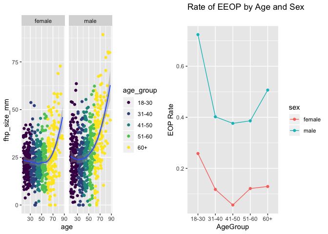

p8105\_midterm\_mk4022
================
Mary Knoop
10/24/2019

Load librarires for
    analysis

``` r
devtools::install_github("thomasp85/patchwork")
```

    ## Skipping install of 'patchwork' from a github remote, the SHA1 (36b49187) has not changed since last install.
    ##   Use `force = TRUE` to force installation

``` r
library(tidyverse)
```

    ## ── Attaching packages ───────────────────────────────────────────────────────────────────── tidyverse 1.2.1 ──

    ## ✔ ggplot2 3.2.1     ✔ purrr   0.3.2
    ## ✔ tibble  2.1.3     ✔ dplyr   0.8.3
    ## ✔ tidyr   1.0.0     ✔ stringr 1.4.0
    ## ✔ readr   1.3.1     ✔ forcats 0.4.0

    ## ── Conflicts ──────────────────────────────────────────────────────────────────────── tidyverse_conflicts() ──
    ## ✖ dplyr::filter() masks stats::filter()
    ## ✖ dplyr::lag()    masks stats::lag()

``` r
library(knitr)
library(readxl)
library(dplyr)
library(patchwork)
```

Problem 1 Part 1: Import and clean the data. Format the data to use
appropriate variable names; fill in missing values with data where
appropriate (as indicated in the header information); create character
and ordered factors for categorical variables.

``` r
posture_data = 
  read_excel("/Users/maryknoop/Desktop/Data_Sci/p8105_midterm_mk4022/data/p8105_mtp_data.xlsx", skip = 8) %>%
  janitor::clean_names() %>%
  mutate(
    eop_size_mm = replace_na(eop_size_mm, 0),
    eop_size = factor(eop_size, c("0", "1", "2", "3", "4", "5"), c("0-5", "5-10", "10-15", "15-20", "20-25", "25+"), ordered = TRUE), 
    sex = factor(sex, c(0, 1), c("female", "male")),
    fhp_category = factor(fhp_category,c(0, 1, 2, 3, 4, 5, 6, 7),c("0-10", "10-20", "20-30", "30-40", "40-50", "50-60", "60-70", "70-80"), ordered = TRUE),
    age_group = factor(age_group, c("2", "3", "4", "5", "6", "7", "8"), c("18-30", "31-40", "41-50", "51-60", "60+", "60+", "60+"), ordered = TRUE)) %>%
    filter(age_group != "1")
posture_data
```

    ## # A tibble: 1,219 x 9
    ##    sex     age age_group eop_size_mm eop_size eop_visibility_… eop_shape
    ##    <fct> <dbl> <ord>           <dbl> <ord>               <dbl>     <dbl>
    ##  1 male     18 18-30            14.8 10-15                   2         3
    ##  2 male     26 18-30            17.1 15-20                   2         3
    ##  3 fema…    22 18-30             0   0-5                     1        NA
    ##  4 male     20 18-30            23.9 20-25                   2         1
    ##  5 fema…    27 18-30             0   0-5                     0        NA
    ##  6 fema…    28 18-30             7.9 5-10                    2         2
    ##  7 male     21 18-30             9.4 5-10                    2         2
    ##  8 fema…    25 18-30             0   0-5                     0        NA
    ##  9 male     30 18-30            16.5 15-20                   2         2
    ## 10 male     27 18-30            22.8 20-25                   2         1
    ## # … with 1,209 more rows, and 2 more variables: fhp_size_mm <dbl>,
    ## #   fhp_category <ord>

Part 2: Briefly describe the data cleaning process and the resulting
dataset, identifying key variables based on your understanding of the
original scientific report. How many participants are included? What is
the age and gender distribution (a human-readable table may help here)?

The dataset posture\_data is comprised of 9 columns. Key variables
include We have 1,219 participants included in the posture\_data
dataset. The age and gender distribution is

``` r
agesex_table = posture_data %>%
filter(age_group != "1") %>%
group_by(sex, age_group) %>%
summarize (n= n()) %>%
pivot_wider(
names_from = sex, 
values_from = n
) %>%
knitr::kable ()
agesex_table
```

| age\_group | female | male |
| :--------- | -----: | ---: |
| 18-30      |    151 |  152 |
| 31-40      |    102 |  102 |
| 41-50      |    106 |  101 |
| 51-60      |     99 |  101 |
| 60+        |    155 |  150 |

``` r
agesex_plot=
posture_data %>% 
ggplot(aes(x = age, fill = sex)) +
geom_histogram()
agesex_plot
```

    ## `stat_bin()` using `bins = 30`. Pick better value with `binwidth`.

<!-- -->

Problem 2 Figure 3 shows only the mean and standard deviation for FHP,
but does not show the distribution of the underlying data. Figure 4
shows the number of participants in each age and sex group who have an
enlarged EOP (based on categorical EOP Size – groups 0 and 1 vs groups
2, 3, 4, and 5). However, the number of participants in each age and sex
group was controlled by the researchers, so the number with enlarged EOP
in each group is not as informative as the rate of enlarged EOP in each
group. Create a two-panel figure that contains improved versions of both
of these.

``` r
figure3 = 
ggplot(posture_data, aes(x = age, y = fhp_size_mm, na.rm = TRUE)) +
geom_point(aes(color = age_group)) + 
geom_smooth(size = .7, se = TRUE) + 
facet_grid(~sex)
figure3
```

    ## `geom_smooth()` using method = 'loess' and formula 'y ~ x'

    ## Warning: Removed 6 rows containing non-finite values (stat_smooth).

    ## Warning: Removed 6 rows containing missing values (geom_point).

<!-- -->

``` r
figure4 = 
posture_data %>% 
mutate(enlarged_eop = as.numeric(ifelse(eop_size_mm >=10, "1", "0"))) %>% 
group_by(age_group, sex) %>% 
summarize(rate = mean(enlarged_eop)) %>% 
ggplot(aes(x = age_group, y = rate, group =sex, color = sex)) +
geom_point () +
geom_line () +
labs(
title = "Rate of enlarged EOP by Age and Sex",
x = "Age_Group",
y = "EOP Rate")
figure4
```

<!-- -->

``` r
figure3+figure4
```

    ## `geom_smooth()` using method = 'loess' and formula 'y ~ x'

    ## Warning: Removed 6 rows containing non-finite values (stat_smooth).
    
    ## Warning: Removed 6 rows containing missing values (geom_point).

<!-- -->

Part 2: Create a 2 x 5 collection of panels, which show the association
between FHP size and EOP size in each age and sex group. Comment on your
plots with respect to the scientific question of interest.

``` r
posture_data %>%
  ggplot(aes(x = eop_size_mm, y = fhp_size_mm, na.rm = TRUE, color = age_group)) +
         geom_point () + facet_grid (sex ~ age_group) + labs (title = "2x5 Panel" , 
    x = "eop_size_mm" , 
    y = "fhp_size_mm")
```

    ## Warning: Removed 6 rows containing missing values (geom_point).

<!-- -->

Problem 3 Part 1: \* Are the authors’ stated sample sizes in each age
group consistent with the data you have available? \* Are the reported
mean and standard deviations for FHP size consistent with the data you
have available? \* The authors find “the prevalence of EEOP to be 33% of
the study population”. What is the definition of EEOP, and what
variables can you use to evaluate this claim? Is the finding consistent
with the data available to you? \* FHP is noted to be more common in
older subjects, with “FHP \>40 mm observed frequently (34.5%) in the
over 60s cases”. Are the broad trends and specific values consistent
with your data?

Sample sizes from paper: 18–30 n=300, 31–40 n=200, 41–50 n=200, 51–60
n=200 and \>60
n=300

``` r
mean(pull(filter(posture_data,sex == "female"), fhp_size_mm), na.rm = TRUE)
```

    ## [1] 23.71455

``` r
sd(pull(filter(posture_data,sex == "female"), fhp_size_mm), na.rm = TRUE)
```

    ## [1] 10.62294

``` r
mean(pull(filter(posture_data,sex == "male"), fhp_size_mm), na.rm = TRUE)
```

    ## [1] 28.48993

``` r
sd(pull(filter(posture_data,sex == "male"), fhp_size_mm), na.rm = TRUE)
```

    ## [1] 14.66856
